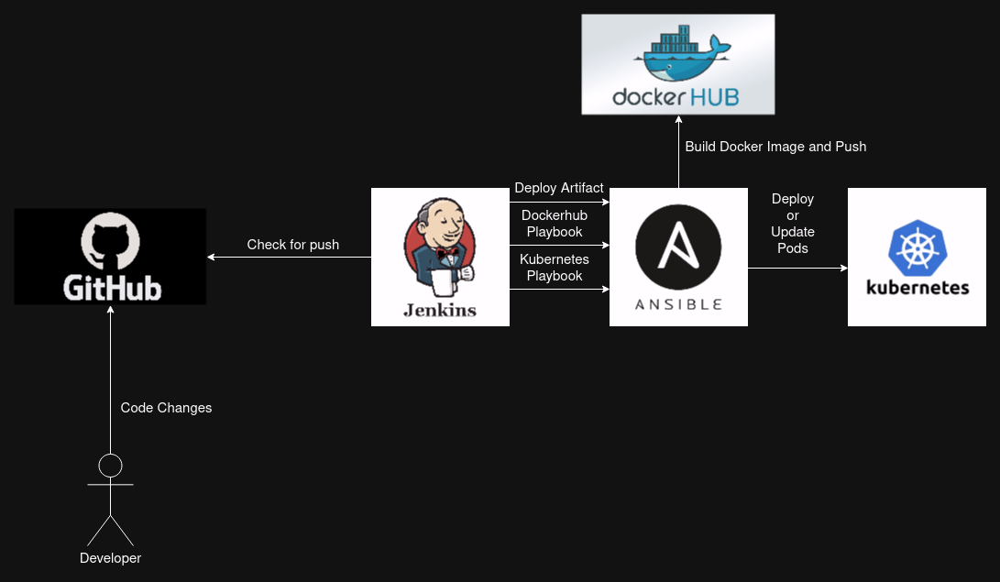

# Jenkins CI/CD Pipeline

## Understanding The Workflow

**Note**: The entire pipeline is configured to fail if any step fails

1. User pushes code changes to Github
2. Jenkins server detects the change
3. Using Maven, Jenkins creates the artifact and copies it on the Ansible server
4. Jenkins activates the Dockerhub Playbook on the Ansible server
    1. Builds Docker with new artifact
    2. Creates a tag to push image onto Dockerhub
    3. Pushes onto Dockerhub
5. Jenkins activates the Kubernetes Playbook on the Ansible server
    1. Deploy app (first use)
    2. Create service (first use)
    3. Perform rolling update